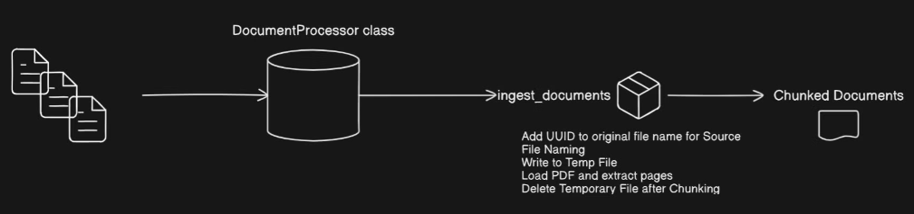
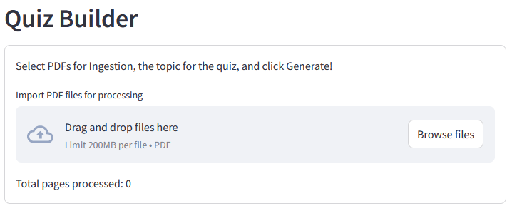
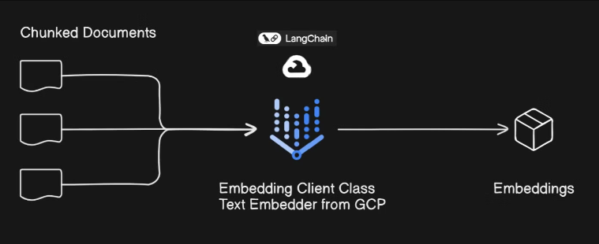
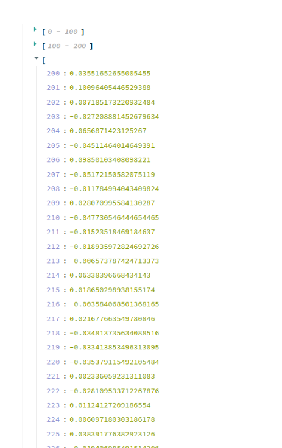
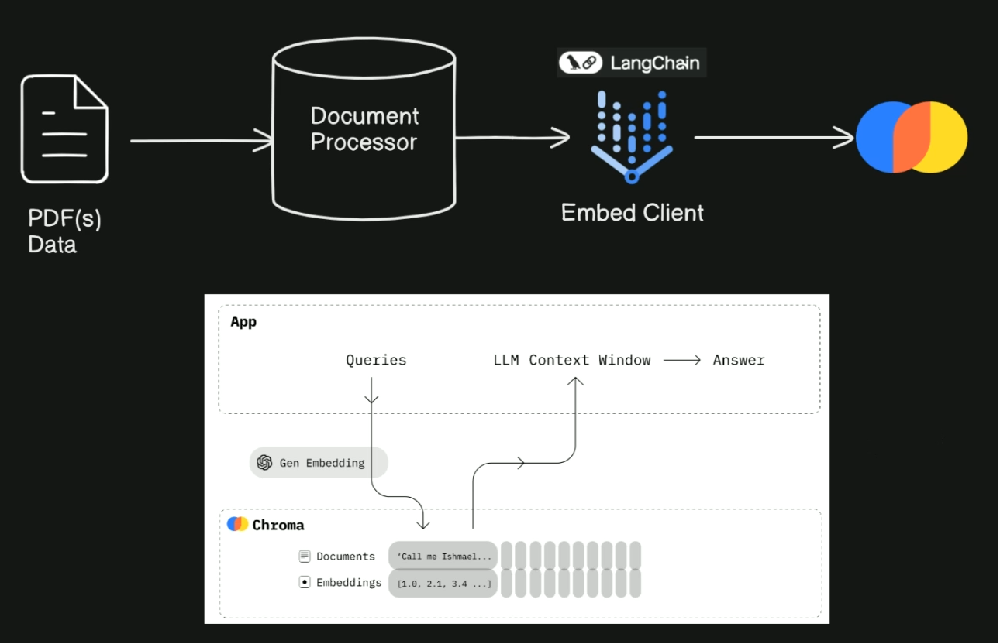
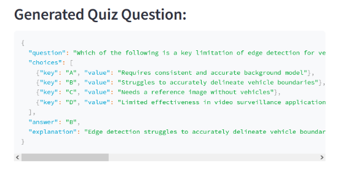
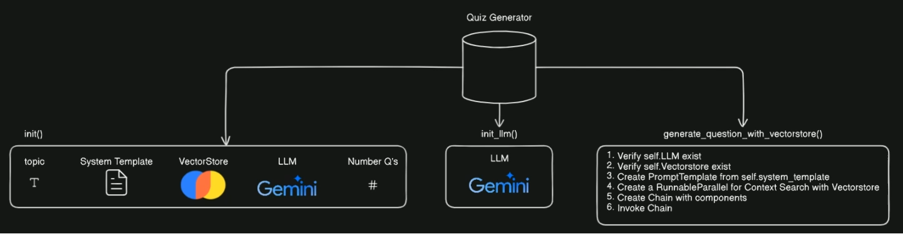
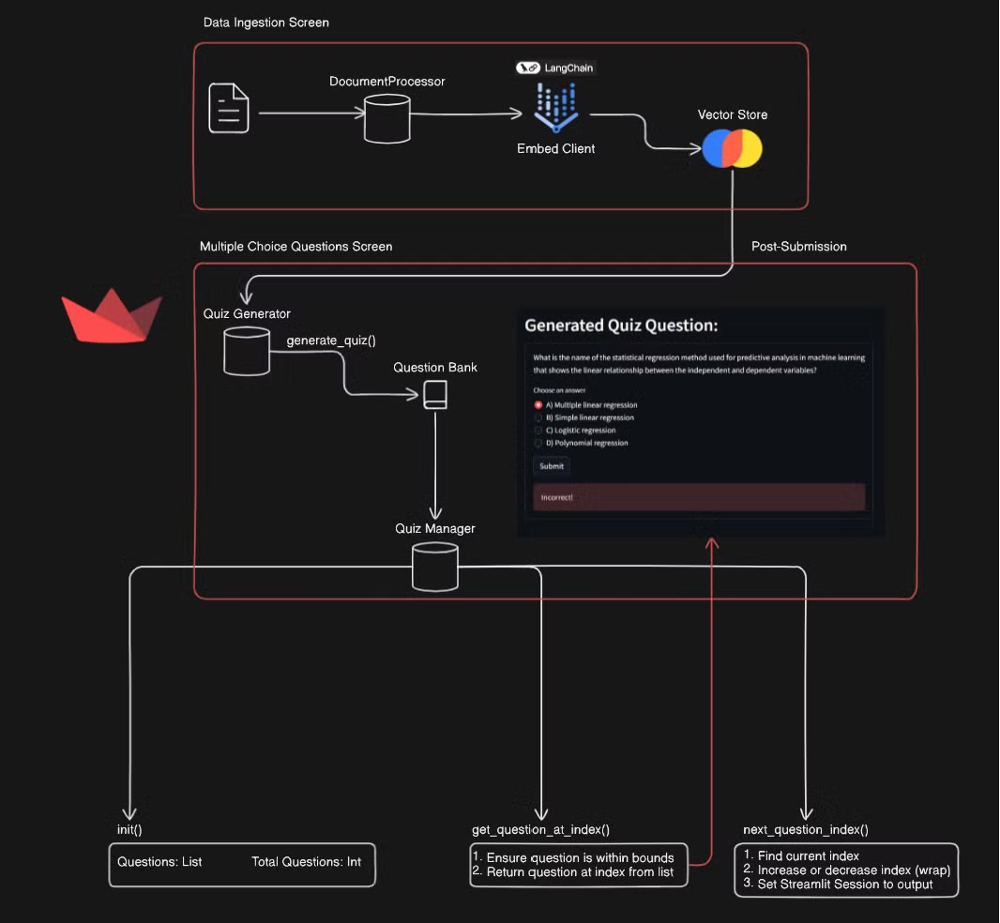

# Gemini Quizify

<video width="1000" height="400" controls>
  <source src="./readme/demo.mov" type="video/mp4">
  Your browser does not support the video tag.
</video>

## Overview

Gemini Quizify is a **Streamlit app** that uses **Gemini AI model** to generate quiz questions based on user-inputted documents. Users can choose up to 10 multi-choice questions with detailed explanations to the correct answer. <u>This tool provides students with an effective way to reinforce their understanding of concepts by quizzing themselves</u>.

## Table of Contents
- [Tutorial](#tutorial)
    - [Set Up](#1-set-up-task-1)
    - [Data Ingestion](#2-data-ingestion-tasks-2-3)
    - [Data Embedding](#3-data-embedding-task-4)
    - [ChromaDB](#4-chromadb-tasks-5-6)
    - [Quiz Builder](#5-quiz-builder-task-7)
    - [Quiz Generator](#6-quiz-generator-tasks-7-8)
    - [Quiz Manager](#7-quiz-manager-tasks-9-10)
- [Challenges](#challenges)
- [Acknowledges](#acknowledgements)
- [Certificate](#certificate)

## Tutorial
### 1. Set Up (Task 1)
- Fork this [repo](https://github.com/radicalxdev/mission-quizify)
- Create a new project on [Google Cloud Console](https://console.cloud.google.com/) with your desired name
    - Go to [Vertex AI](https://cloud.google.com/vertex-ai?hl=en) and enable all recommended APIs
    - Create a service account, setting its role as Owner within Basic
    - Download the authentication key as a JSON file
    - Put the JSON file into your repo and update your ``.gitignore`` to ignore this file
    - Run the following code:
        ```
        export GOOGLE_APPsLICATION_CREDENTIALS = "/path/to/your/authentication.json"
        ```

    - Build a virtual environment and install the necessary libraries. Also, add this directory to your ignore file
        ```
        python3 -m venv env
        ```
        ```
        source env/bin/activate
        ```
        ```
        pip install -r requirements.txt
        ```

### 2. Data Ingestion (Tasks 2-3)




Data ingestion involes a PDF uploader. The total number of pages processed is displayed.

### 3. Data Embedding (Task 4)




Vertex AI is used to embed the user data. The above image shows a snippet of the embedding for "Hello World".

### 4. ChromaDB (Tasks 5-6)


In this step, we ensure document processing by splitting text chunks using `CharacterTextSplitter` and creating a Chroma collection in memory. For more information about ChromaDB, see [here](https://docs.trychroma.com/).

### 5. Quiz Builder (Task 7)


The embedded data is used to generate quiz questions using the vector store as a retriever. The generated question is stored as a dictionary.

### 6. Quiz Generator (Tasks 7-8)


The quiz generator utilizes the questions built in the previous step and creates a user interface for taking the quiz.

### 7. Quiz Manager (Tasks 9-10)


The quiz manager handles the backend operations for managing questions. It stores user attempts and scores. It uses call backs to move either move forward or backward questions.

## Acknowledgements
Thank you to [Radical AI](https://lab.radicalai.app/) for providing this insighting opportunity on LLMs, vector search, and Streamlit integration

## Certificate

